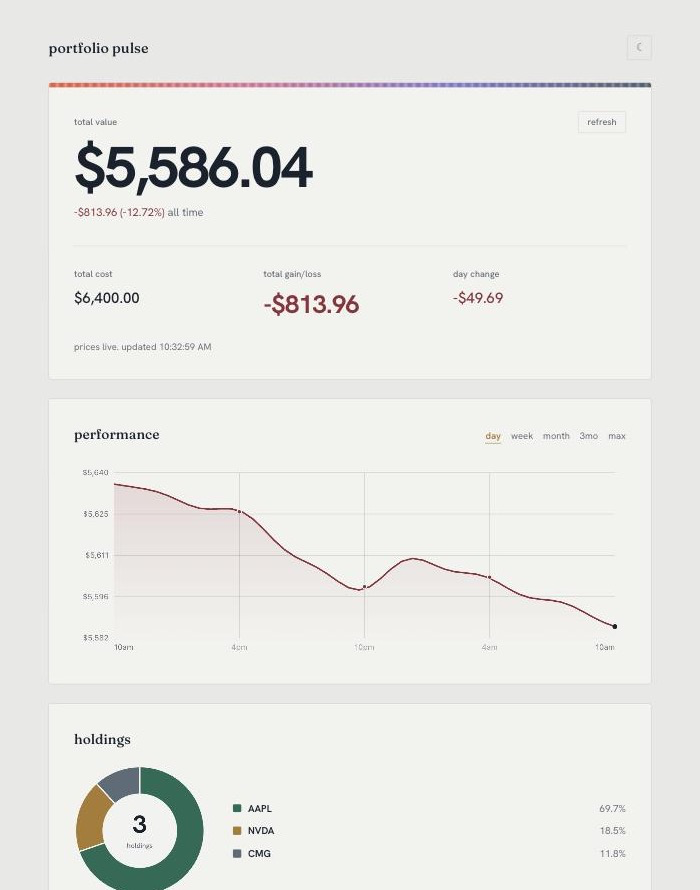

# portfolio pulse

a personal stock dashboard for holdings i track by hand. live prices, news context on the days something moves, and a simple growth projection. final project for oim 3690 with zhi li at babson, summer 2026.

live: https://teoria-teoria.github.io/portfolio-pulse/

## screenshot

_screenshot placeholder. drop `screenshot.png` in the repo root, then uncomment the line below._

<!--  -->

## what it does

- add a holding by ticker, shares, and cost basis. it saves to localStorage, so it survives a reload. edit or delete anytime.
- pulls a live quote per holding and shows gain or loss for each one plus a total. green for up, red for down. outside market hours it labels prices "as of last close" instead of posing as live.
- when a holding moves 2 percent or more in a day, it pulls recent headlines for that ticker so a big move comes with context. those headlines cache per day so a refresh does not burn extra calls.
- a "worth a look" section scans the general market news feed against three interest tags. qsr, tech and ai, and edge computing. it is informational surfacing only, not advice.
- a projection tab. set a starting balance, a timeline in months, and a monthly growth rate that can be negative. it draws the compounding curve on a canvas and recalculates as you change any input.

## which api

Finnhub (https://finnhub.io). free tier. three endpoints.

- `/quote` for live prices.
- `/company-news` for headlines on a mover.
- `/news?category=general` for the worth-a-look scan.

the key is not in the repo. it lives in a `config.js` that stays gitignored. to run this yourself, get a free key at finnhub.io and add it:

```js
// config.js
const FINNHUB_API_KEY = "your-key-here";
```

then serve the folder over http (a plain file open will not run the fetch calls) and open index.html.

## a note on scope

this is a manual-entry tool. it is not connected to any brokerage. nothing here places trades or reads a real account. you type in what you hold and it shows prices and context around it. no buy or sell calls anywhere.

## stack

vanilla JavaScript, no framework, no build step. one canvas chart drawn by hand instead of a chart library. deployed on GitHub pages.
